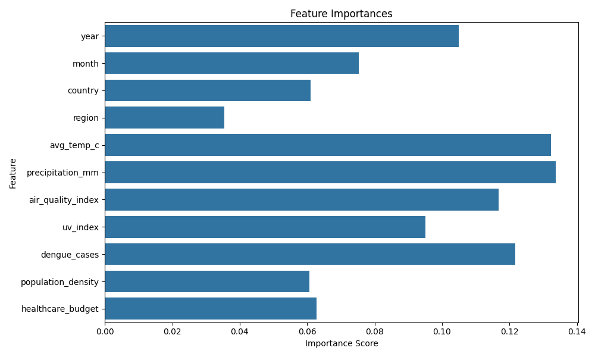
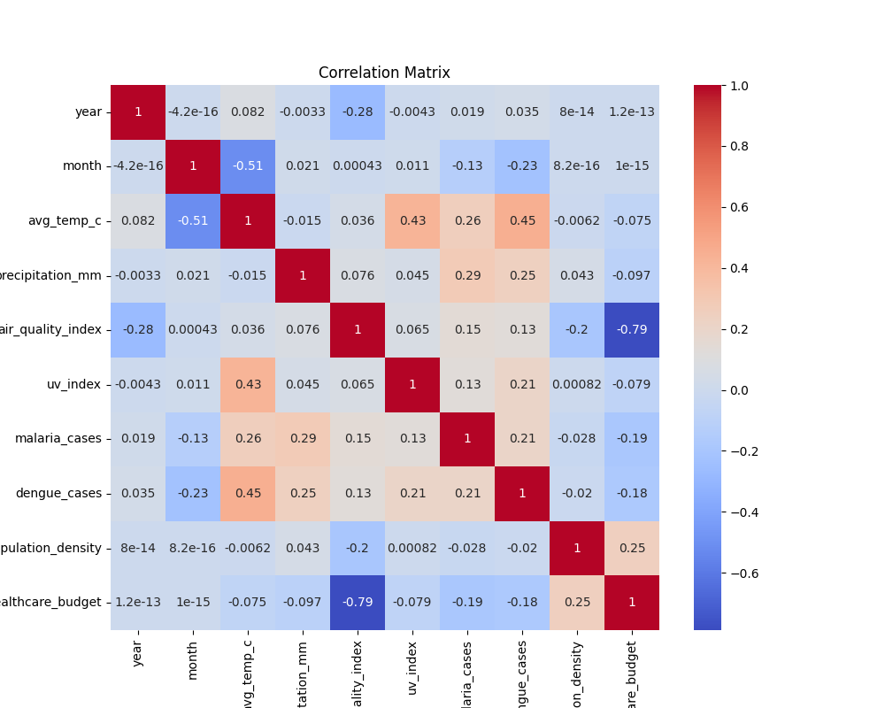
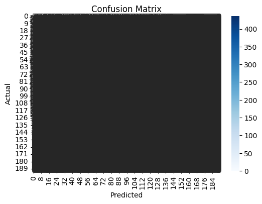
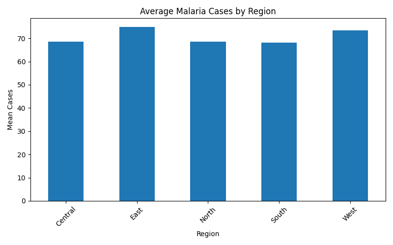

# Executive-Simulation-AI: Machine Learning for Sustainable Development

**GitHub Repo:** [Executive-Simulation-AI](https://github.com/MykeShale/Executive-Simulation-AI)

---

## 🌍 Project Overview
This project is part of the PLP Week 2 Assignment: "Machine Learning Meets the UN Sustainable Development Goals (SDGs)". Our team designed an AI-driven solution to address a real-world challenge aligned with the UN SDGs, demonstrating how machine learning can drive positive global impact.

---

## 1. SDG Focus & Problem Statement

- **Chosen SDG:** SDG 3 – Good Health and Well-being
- **Problem:** Predicting malaria outbreaks using climate and health data to enable early intervention and resource allocation in vulnerable regions.

---

## 2. Team Roles & Responsibilities

| Member    | Role                                | Responsibility                                                                                                 |
|-----------|-------------------------------------|----------------------------------------------------------------------------------------------------------------|
| Mike      | 👨‍💻 Machine Learning Developer      | Built the Random Forest model in the notebook, evaluated it, and generated the feature importance visualization. |
| Violet    | 🌍 Ethics & Reflection Lead          | Wrote the Ethical Reflection section, discussing data bias, fairness, and sustainability of the AI solution.   |
| Lukhanyo  | 📄 Documentation Manager             | Created a detailed README.md file for the GitHub repo.                                                          |
| Tshimo    | 🎤 Communications & Presentation Lead| Wrote a short article for LMS and prepared a pitch deck (5-minute presentation) to explain the solution and its impact. |

---

## 3. Machine Learning Approach

- **Type:** Supervised Learning
- **Algorithm:** Random Forest Classifier
- **Task:** Predict malaria outbreak risk (binary classification) based on climate and disease data.
- **Dataset:** `climate_disease.csv` (open-source, see `/malaria-outbreak-ai/data/`)
- **Tools:** Python, Jupyter Notebook, scikit-learn, pandas, matplotlib, seaborn

---

## 4. Workflow

1. **Data Collection & Preprocessing**
   - Cleaned and normalized climate and disease data.
   - Handled missing values and encoded categorical variables.
2. **Exploratory Data Analysis**
   - Visualized correlations between climate factors and malaria cases.
   - Identified key features influencing outbreaks.
3. **Model Training & Evaluation**
   - Split data into training and test sets.
   - Trained a Random Forest Classifier.
   - Evaluated using accuracy, precision, recall, and F1-score.
4. **Visualization**
   - Feature importance plot
   - Correlation heatmap
   - Regional case distribution
5. **Ethical Reflection**
   - Discussed data bias, fairness, and sustainability implications.

---

## 5. Results

- **Accuracy:** _[Insert value from notebook]_
- **Key Features:** Temperature, rainfall, humidity, previous case counts
- **Visualizations:**
**Feature Importance**
  - 

  **Correlation Heatmap**
  - 

  **COnfusion Matrix**
  - 

  **Regional Cases**
  - 


---

## 6. Ethical & Social Reflection

- **Bias:** Data may underrepresent remote or underreported regions, potentially skewing predictions.
- **Fairness:** The model aims to support equitable resource allocation, but must be regularly updated with diverse data.
- **Sustainability:** Early outbreak prediction enables targeted interventions, reducing disease burden and supporting healthier communities.

---

## 7. How to Run

1. **Clone the repository:**
   ```bash
   git clone https://github.com/MykeShale/Executive-Simulation-AI.git
   cd Executive-Simulation-AI/malaria-outbreak-ai
   ```
2. **Install dependencies:**
   - Recommended: Use a virtual environment.
   - Install required packages:
     ```bash
     pip install -r requirements.txt
     ```
3. **Run the Jupyter Notebook:**
   ```bash
   jupyter notebook malaria_model.ipynb
   ```
   - Follow the notebook cells to reproduce the analysis, model training, and visualizations.
4. **View Results:**
   - Screenshots and output plots are available in the `malaria-outbreak-ai/` directory and `screenshots/`.

---

## 8. Screenshots

See `/malaria-outbreak-ai/screenshots/` for demo images and results.

---

## 9. References

- [Kaggle Datasets](https://www.kaggle.com/datasets)
- [World Bank Open Data](https://data.worldbank.org/)
- [UN SDG Database](https://unstats.un.org/sdgs/)

---

## 10. License

This project is for educational purposes as part of the PLP Academy.

---

## 11. Team Contacts

- Mike: [GitHub](https://github.com/MykeShale)
- Violet: [GitHub](https://github.com/violetwanjiru)
- Lukhanyo: [GitHub](https://github.com/Luu-17)
- Tshimo: [GitHub](https://github.com/TshimoHlapane)

---

> "AI can be the bridge between innovation and sustainability." — UN Tech Envoy

---

For more details, see the [`malaria_model.ipynb`](malaria-outbreak-ai/malaria_model.ipynb) notebook and project screenshots.

**[Project GitHub Link](https://github.com/MykeShale/Executive-Simulation-AI)**
